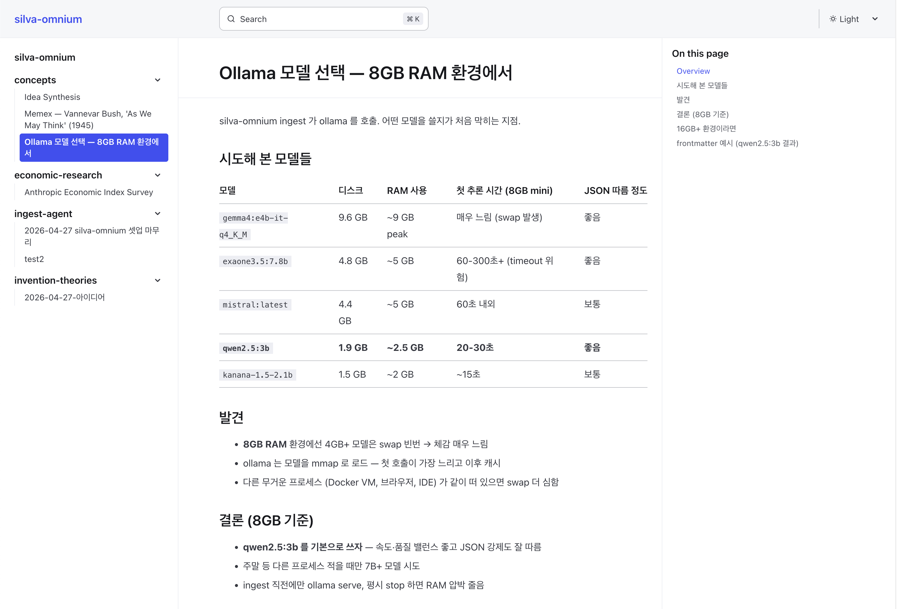
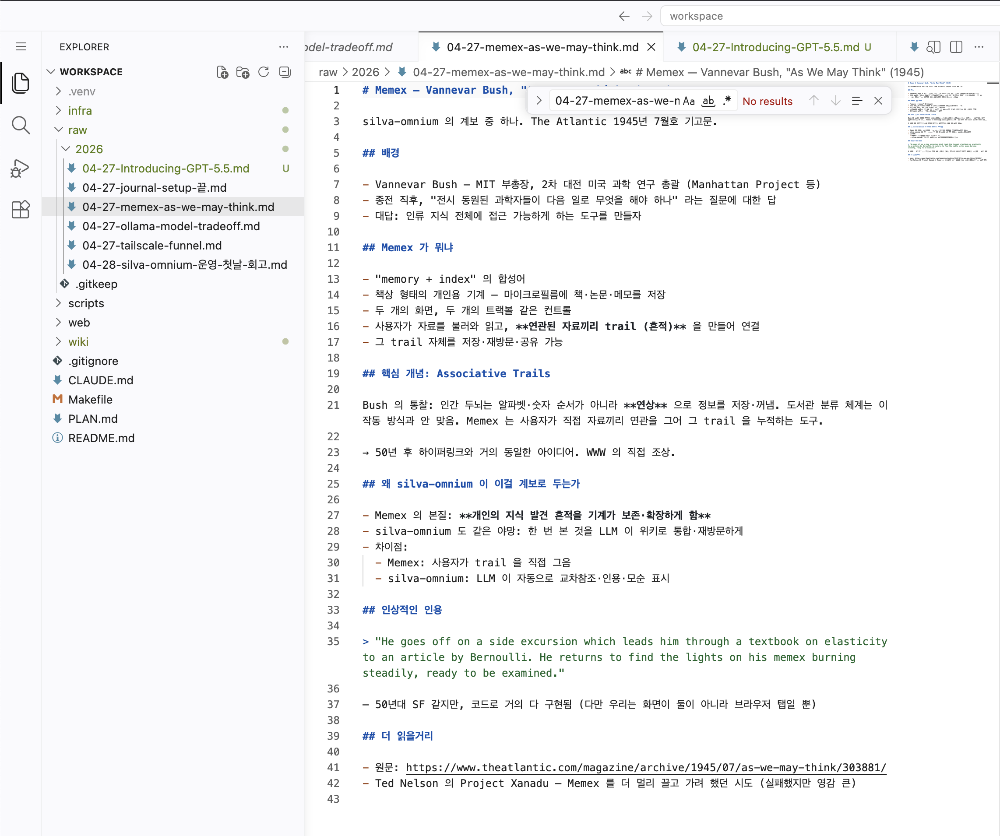
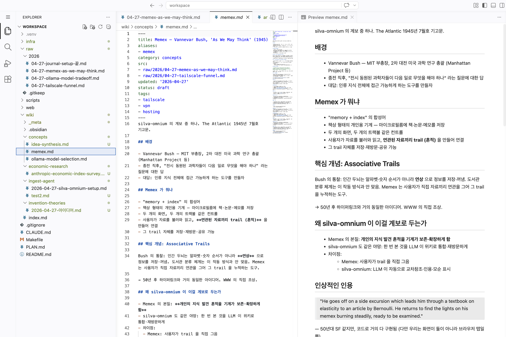
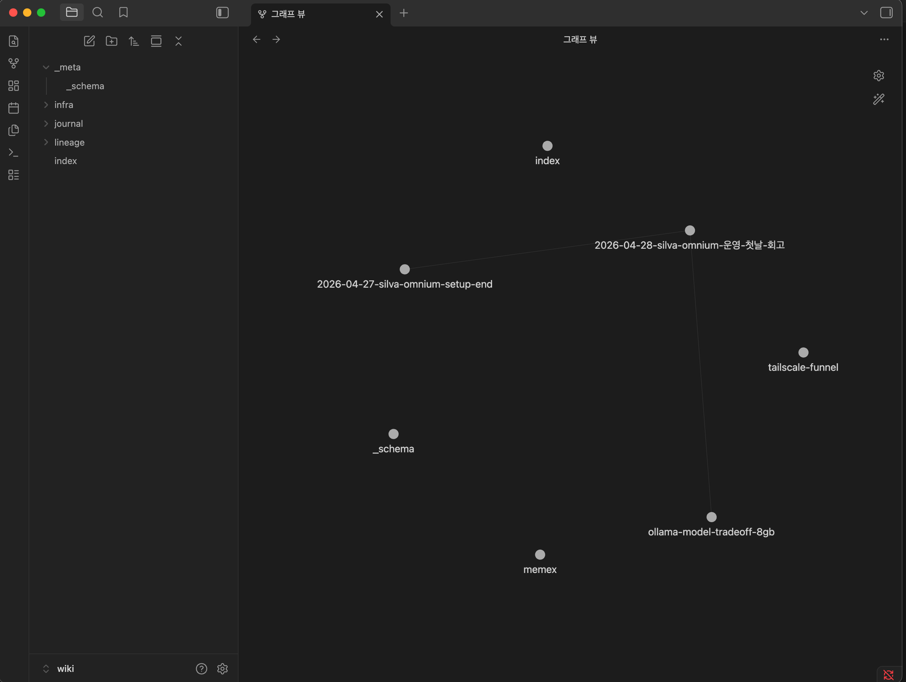
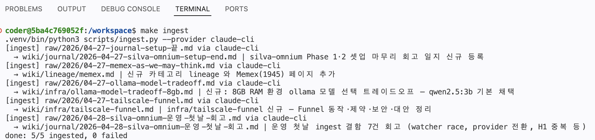
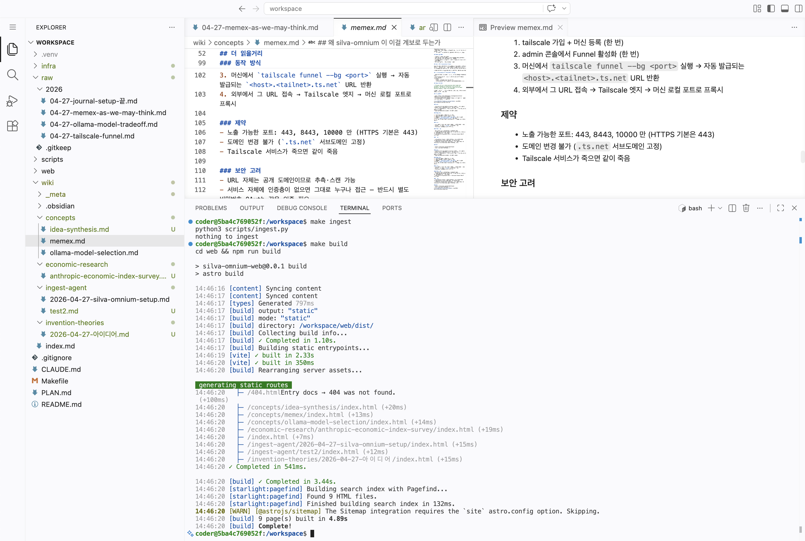
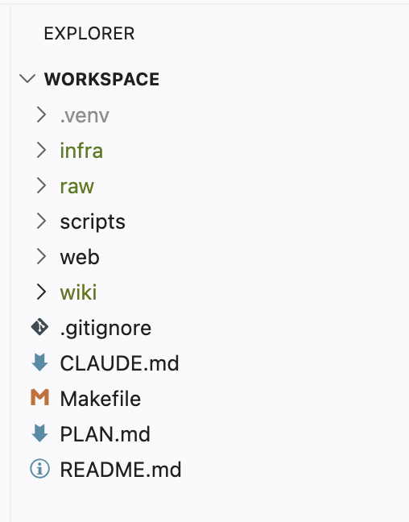

# silva-omnium

> 모든 것이 쌓이는 개인 지식 숲.

<br>

<p align="center">
  
  <br><sub><em>Astro Starlight 로 빌드된 위키 — 사이드바 카테고리는 ingest 가 자동 분류한다</em></sub>
</p>

<br>

## 왜

LLM 으로 문서를 다루는 대부분의 방식은 질문할 때마다 지식을 처음부터 재발견합니다. 같은 문서에 10번 질문하면 → 10번 재발견.

silva-omnium 은 이걸 뒤집습니다. 소스는 한 번만 넣으면 됩니다. LLM 이 읽고, 영속 위키에 통합하고, 기존 페이지와의 모순을 표시하고, 인용을 연결하고, 커밋합니다. 10번째 질문 즈음이면 위키가 이미 종합을 마친 상태입니다.

## 계보

- [Andrej Karpathy 의 LLM Wiki 패턴](https://gist.github.com/karpathy/442a6bf555914893e9891c11519de94f) — LLM 이 노트를 정리하는 디자인 원형
- 폴란드-리투아니아 연합의 `silva rerum` — 가문 대대로 이어 쓴 잡록. "사물의 숲"

## 흐름

```
raw/ ──(watcher / make ingest)──▶ wiki/ ──(make build)──▶ [Astro Starlight 사이트] + [Obsidian 그래프]
```

- **사람**: 소스 큐레이션, 분석 방향 결정 (`raw/` 만 만지면 됨)
- **LLM** (Ollama 또는 Claude): 요약, 교차참조, 인용 부착, 모순 탐지, frontmatter·카테고리 자동 분류
- **위키**: 시간에 따라 쌓임. 같은 주제가 다시 들어오면 기존 페이지를 갱신

**1. raw/ 입력** — 사용자가 떨어뜨리는 원본 메모. 형식·길이 자유, 정리 안 돼 있어도 됨.

<p align="center">
  
  <br><sub><em>raw/2026/ 에 떨어진 사용자 원본 메모 — 이대로 ingest 입력</em></sub>
</p>

<br>

**2. wiki/ 출력** — ingest 후 frontmatter·카테고리·출처 각주가 붙어 영속 위키 페이지로 저장.

<p align="center">
  
  <br><sub><em>좌: raw/wiki 트리 · 가운데: wiki 마크다운(frontmatter + 각주) · 우: 렌더 프리뷰</em></sub>
</p>

<br>

**3. Obsidian 그래프** — 페이지가 쌓일수록 주제 간 연결이 그래프로 드러남.

<p align="center">
  
  <br><sub><em>wiki 페이지가 노드로, 교차 참조가 엣지로 시각화</em></sub>
</p>

<br>

## Quick start

```bash
git clone https://github.com/peterica/silva-omnium.git
cd silva-omnium
make setup       # python venv + npm install + symlinks

# 1. 노트 떨어뜨리기
mkdir -p raw/2026
echo "# 첫 노트" > raw/2026/test.md

# 2. ingest (기본은 Ollama, 모델은 환경변수 OLLAMA_MODEL 로 변경 가능)
make ingest      # → wiki/<카테고리>/<slug>.md 자동 생성

# 3. 위키 빌드 + 보기
make build && make dev    # http://localhost:4321
```

`make ingest-claude` 로 Claude API provider 도 사용 가능 (`ANTHROPIC_API_KEY` 필요).

> 로컬 / 자체호스팅 두 갈래의 차이와 Docker 가 등장하는 이유는 [`docs/USER_GUIDE.md`](./docs/USER_GUIDE.md) 참고.

<br>

<p align="center">
  
  <br><sub><em>make ingest — raw 메모가 카테고리별 wiki 페이지로 분류·생성된다</em></sub>
</p>

<br>

<p align="center">
  
  <br><sub><em>이어서 make build — Astro Starlight 가 wiki/ 를 정적 사이트로 빌드</em></sub>
</p>

<br>

## 구조

```
silva-omnium/
├── raw/                  사용자 원본 — 불변, Obsidian/웹 편집기에서 자유 편집
├── wiki/                 LLM 관리 — frontmatter 스키마 + 카테고리 자동 분류
│   └── _meta/            카테고리 레지스트리, ingest 캐시, 스키마 정의
├── scripts/              ingest 파이프라인 (Python)
│   └── llm_providers/    Ollama / Claude provider 플러그인
├── web/                  Astro Starlight 정적 사이트
├── infra/                자체호스팅 (Mac mini + Docker + Tailscale)
└── docs/                 설계 문서·plan
```

<p align="center">
  
  <br><sub><em>다섯 축 디렉토리 — raw / wiki / scripts / web / infra</em></sub>
</p>

<br>

## 자체호스팅 (선택)

상시 머신 (예: M1 Mac mini) 에 silva-omnium 을 24/7 띄우면 어디서든 웹 브라우저로 편집·열람·AI 협업이 가능합니다.

- 웹 편집기: **code-server** (VS Code in browser) — 트리·에디터·통합 터미널·`claude` 명령 사전 설치
- 정적 사이트: Astro 빌드 결과를 **Caddy** 가 서빙
- 자동 ingest: `raw/` 변경 시 fswatch → docker compose exec → `make ingest && make build`
- 외부 접근: **Tailscale Funnel** — 공개 URL, 도메인·포트포워딩 불필요

상세 셋업: [`infra/README.md`](./infra/README.md). 멘탈 모델(저장소가 어디에 사는지·Docker 가 무엇을 담는지) 부터 보려면 [`docs/USER_GUIDE.md`](./docs/USER_GUIDE.md).

## Tech stack

- Python 3.13 + PyYAML (ingest)
- Astro 6 + Starlight 0.38 (사이트)
- Ollama (local LLM, 8GB RAM 권장 모델: `qwen2.5:3b`)
- Anthropic Claude (선택 provider)
- Docker + Caddy + Tailscale Funnel + code-server + Claude Code (자체호스팅)

## 규칙 (협업·AI 에이전트용)

- `raw/` 는 사용자 영역 — Claude/AI 는 읽기만 (편집·삭제 금지)
- `wiki/` 는 AI 가 관리 — 사실 진술은 `[^src-<raw-id>]` 각주로 원본과 연결
- 모순 발견 시 병합하지 말고 `> [!conflict]` callout 으로 명시
- 자세한 사항: [`CLAUDE.md`](./CLAUDE.md)

## 상태

- Phase 1 (ingest 파이프라인 + Astro 빌드 + Obsidian vault + Makefile): 완료
- Phase 2 (자체호스팅 + 웹 편집기 + 외부 접근): 완료
- 다음: 실사용 + 보안 강화 (Funnel 인증 추가 / ollama 외부 노출 차단 등)
